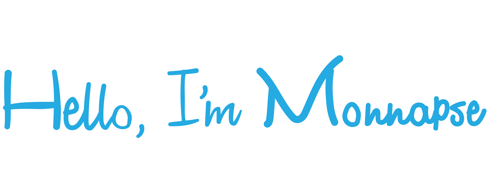

<a href="https://monnapse.masonshuber.repl.co"></img></a>

                                                                                                                           
Hello im Monnapse I love doing all kinds of stuff on computers, making games, programming bots, making graphics.

I currently know Python, Java, Javascript, Luau, HTML, CSS but I am also learning C# and C++ currently. Softwares I use is Roblox Studio, Unreal Engine 5, Visual Studio 2022, Visual Studio Code, Substance Painter, Substance Sampler, Substance Designer, Adobe Photoshop, Adobe Ilustrator, Premeire Pro, Blender.

</img>
